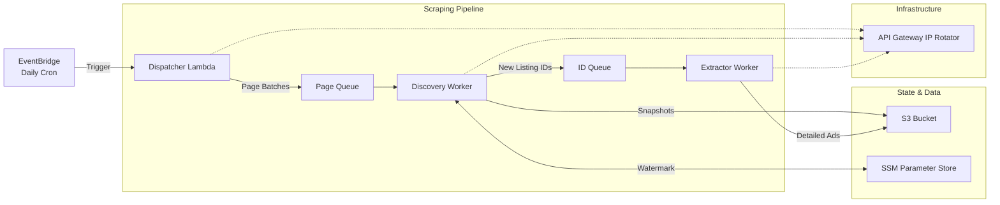
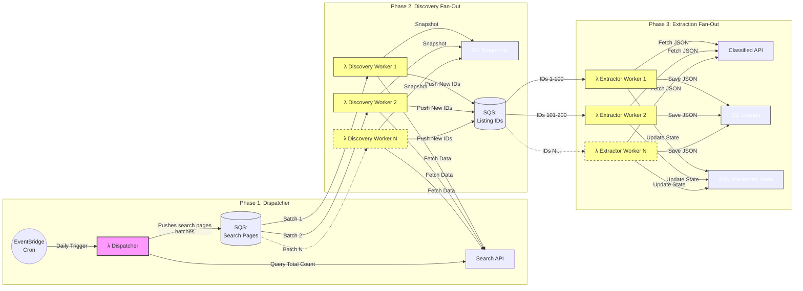

# Serverless at Scale: A Real Estate Data Scraper on AWS

A serverless, scalable, and resilient data pipeline designed to scrape real estate listings from [Immoweb](https://www.immoweb.be/). Built using AWS Lambda, SQS, S3, and dynamic IP rotation techniques to ensure high availability and bypass anti-bot measures.

> **Note:** This repository contains only the raw source code and is not directly linked to the code deployed in AWS. This project is shared for informational purposes; deploying these functions to AWS falls outside the current scope of this repository. An explanation of the project is available in [the following article](https://abdessettar.xyz/projects/serverless-at-scale-real-estate-scraper).

>**Disclaimer:** *The project was developed solely for educational use, with the goal of learning efficient data crawling techniques and gaining experience with aws cloud and architectural concepts. Its code should not be used in high-volume or unauthorized scraping. Please always comply with a website’s `robots.txt` file and its Terms of Service. There is a team of humans behind every website, be nice to them ;).

## Architecture & Workflow

The pipeline follows a decoupled, three-stage architecture. Each stage is an independent AWS Lambda function communicating via SQS queues.


Furthermore, it follows a fan-out pattern, where each stage is independent of the others and can scale horizontally to handle increased load as shown below:


### 1. [Dispatcher](./dispatcher)
The entry point of the pipeline. It runs on a schedule and initializes the scraping run.
*   **Role**: Determines the total number of search pages for various transaction types (e.g., houses for sale, apartments for rent).
*   **Action**: Partitions the total search volume into batches of pages (e.g., 120 pages per batch) and sends them to the Discovery SQS queue.

### 2. [Discovery Worker](./discovery_worker)
The "search engine" of the pipeline.
*   **Role**: Processes batches of search results to find new property listings.
*   **Action**: 
    1. Scrapes the assigned search pages.
    2. Stores a raw snapshot of the search results in S3.
    3. Compares found listing IDs against a "High Watermark" stored in **AWS SSM Parameter Store**.
    4. Forwards only **new** IDs (ID > Watermark) to the Extractor SQS queue.
    5. Updates the Watermark with the highest ID found.

### 3. [Extractor Worker](./extractor_worker)
The "deep scraper" of the pipeline.
*   **Role**: Performs detailed extraction of individual property data.
*   **Action**: Fetches comprehensive details for each property (price, surface area, energy class, bedrooms, etc.) and uploads the final structured JSON objects to S3.

---

## Core Technologies & Strategies

### Dynamic IP Rotation
To bypass anti-bot protections and rate limits, all Lambda functions utilize a dynamic IP rotation system. At runtime, each worker creates a temporary **AWS API Gateway** in a random region to route its requests. This ensures that every batch of requests originates from a fresh set of IP addresses.

### Watermarking Logic
To ensure cost-efficiency and avoid redundant processing, the pipeline uses Listing IDs as a temporal marker. Since Immoweb IDs are generally incremental, the **Discovery Worker** only extracts details for IDs it hasn't seen before, using the SSM Parameter Store to keep track of the last processed ID per category.

### Scalability & Resiliency
*   **Decoupled by SQS**: If one stage slows down, messages simply back up in the queue without affecting the rest of the system.
*   **Error Handling**: Built-in retries with backoff for 403 (Forbidden) and 429 (Too Many Requests) errors.
*   **Safe Shutdowns**: The Dispatcher monitors its remaining execution time to ensure all temporary infrastructure (API Gateways) is deleted before the Lambda times out.

---

## Repository Structure

```text
.
├── dispatcher/         # Logic for workload partitioning and scheduling
├── discovery_worker/   # Logic for search result parsing and ID filtering
└── extractor_worker/   # Logic for detailed property data extraction
```

Each folder contains its own `README.md` with detailed technical specifications, environment variable requirements, and logic diagrams.
- [Dispatcher](./dispatcher/README.md)
- [Discovery Worker](./discovery_worker/README.md)
- [Extractor Worker](./extractor_worker/README.md)
