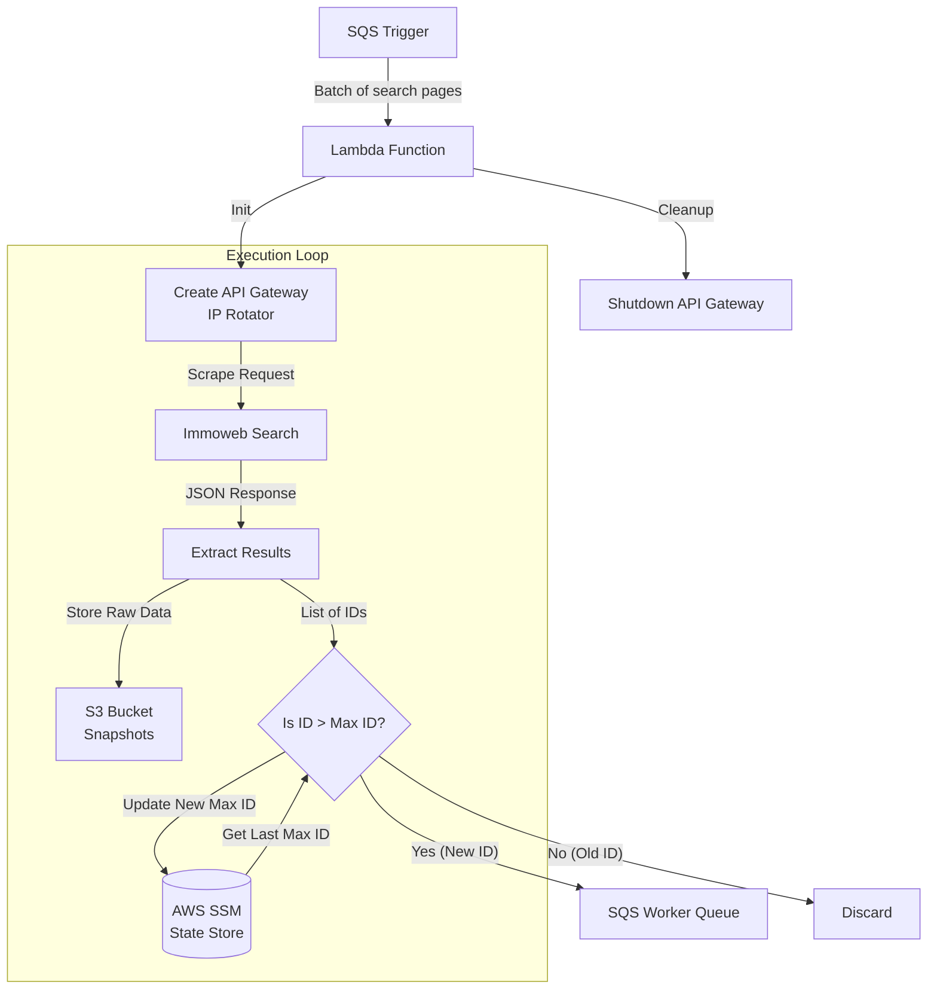

# IDs Batch Crawler Lambda

## Overview
This AWS Lambda function serves as the entry point for the discovery phase of the real estate scraping pipeline. It processes batches of search result pages to identify new property listings.

The function scrapes search pages, sends the raw summary data to S3 (snapshot), filters for new listings (using a watermark stored in SSM), and dispatches the new listings IDs to a downstream queue for detailed processing.

## Logic Flow & Architecture



## Inputs

### Trigger Event
The function is triggered by an SQS Event, which is generated by the dispatcher lambda. The expected payload (body) for each record is:

```json
{
  "transaction_type": "maison/a-vendre", 
  "page_numbers": [1, 2, 3, 4, 5]
}
```
*   `transaction_type`: Used to construct the search URL (e.g., `.../search-results/{transaction_type}`).
*   `page_numbers`: A list of search result page indexes to scrape.

### Environment Variables

| Variable | Description |
|----------|-------------|
| `ID_BATCH_QUEUE_URL` | URL of the downstream SQS queue where new listing IDs are sent. |
| `S3_BUCKET_NAME` | The S3 bucket used for storing raw search result snapshots. |
| `ID_BATCH_SIZE` | Max number of IDs per message sent to the downstream queue (Default: 100). |
| `ACCESS_KEY_ID` | AWS Credentials (required for `requests_ip_rotator`). |
| `ACCESS_KEY_SECRET` | AWS Secret Key (required for `requests_ip_rotator`). |

## Outputs

1.  **S3 Snapshots**: 
    *   **Path**: `s3://{BUCKET}/snapshots/{transaction_type}/{sanitized_type}_{random}_{timestamp}.json`
    *   **Content**: A JSON mapping of `ID -> Listing Data` for the summary data about each ID in the search page.
2.  **Downstream SQS Messages**:
    *   **Destination**: `ID_BATCH_QUEUE_URL`
    *   **Payload**: `{"transaction_type": "...", "listing_ids": [...]}`
3.  **State Update**:
    *   **Target**: AWS Systems Manager (SSM) Parameter Store.
    *   **Logic**: Updates the parameter key `/{transaction_type}` with the highest listing ID found in the batch only if the latter is greater than the current value of the parameter.

## Key Components

### IP Rotation System
To mitigate rate-limiting (403/429 errors), the function implements dynamic infrastructure:
*   Initializes an AWS API Gateway in a random region at runtime.
*   Routes HTTP requests through this gateway using `requests_ip_rotator`.
*   Automatically tears down the gateway upon completion to minimize costs.

### Watermarking State Strategy
To prevent re-processing existing listings:
*   The system maintains a "High Watermark" (the maximum known Listing ID) in SSM.
*   New batches compare discovered IDs against this watermark.
*   Only IDs strictly greater than the watermark are forwarded to the worker queue.
