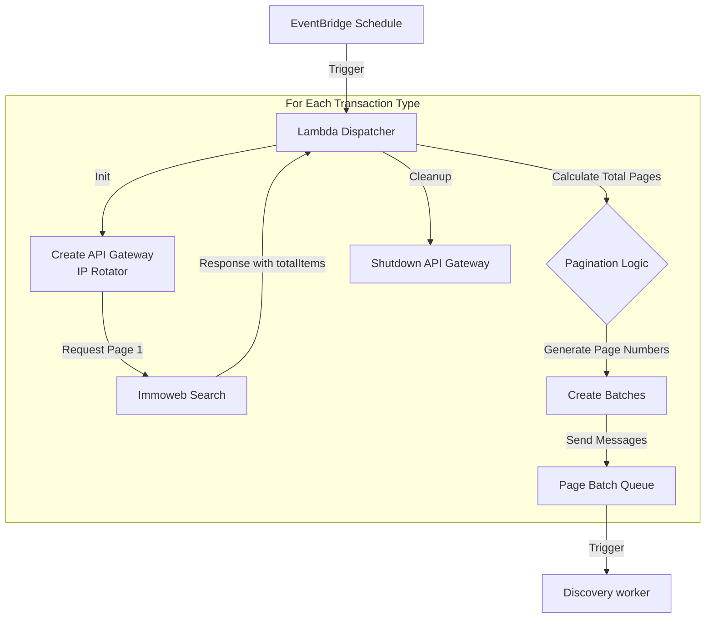

# Dispatcher Lambda (Get Number of Search Pages)

## Overview
This AWS Lambda function acts as the starting point and dispatcher of the pipeline. It is the entry point of the scraping workflow.

Its primary role is to determine the current volume of search results for specific property categories (e.g., Houses for sale, apartments for rent) and partition the workload into manageable batches for downstream processing.

## Logic Flow & Architecture



## Inputs

### Trigger Event
This function is triggered by a daily Scheduled Event (cronjob via AWS EventBridge), running once a night to start a new scrape run.

### Environment Variables

| Variable | Description |
|----------|-------------|
| `PAGE_BATCH_QUEUE_URL` | URL of the SQS queue where page batches are sent. |
| `PAGE_BATCH_SIZE` | Number of search pages to group into a single SQS message (Default: 120). |
| `ACCESS_KEY_ID` | AWS Credentials (required for `requests_ip_rotator`). |
| `ACCESS_KEY_SECRET` | AWS Secret Key (required for `requests_ip_rotator`). |

### Hardcoded Configuration
The function iterates through a specific set of transaction types defined in `TRANSACTION_TYPES`:
*   `maison/a-vendre`
*   `maison/a-louer`
*   `appartement/a-vendre`
*   `appartement/a-louer`

## Outputs

1.  **SQS Messages**:
    *   **Destination**: `PAGE_BATCH_QUEUE_URL`
    *   **Purpose**: Instructs the worker Lambda which pages to scrape.
    *   **Payload Schema**:
        ```json
        {
          "transaction_type": "maison/a-vendre",
          "page_numbers": [1, 2, 3, ..., 120]
        }
        ```

## Key Components

### Dynamic IP Rotation
Similar to the worker Lambda, this function creates a temporary AWS API Gateway to route the initial "discovery" request. This ensures the scrape requests (even just checking the page count) are not blocked by the target site's anti-bot measures.

### Resiliency
*   **Time Management**: Checks `context.get_remaining_time_in_millis()` before starting a new transaction type to ensure it has enough time to cleanly shut down infrastructure.
*   **Fail-Safe**: If `totalItems` is missing from the response, it falls back to a default safety value (9969 items) to ensure coverage.
