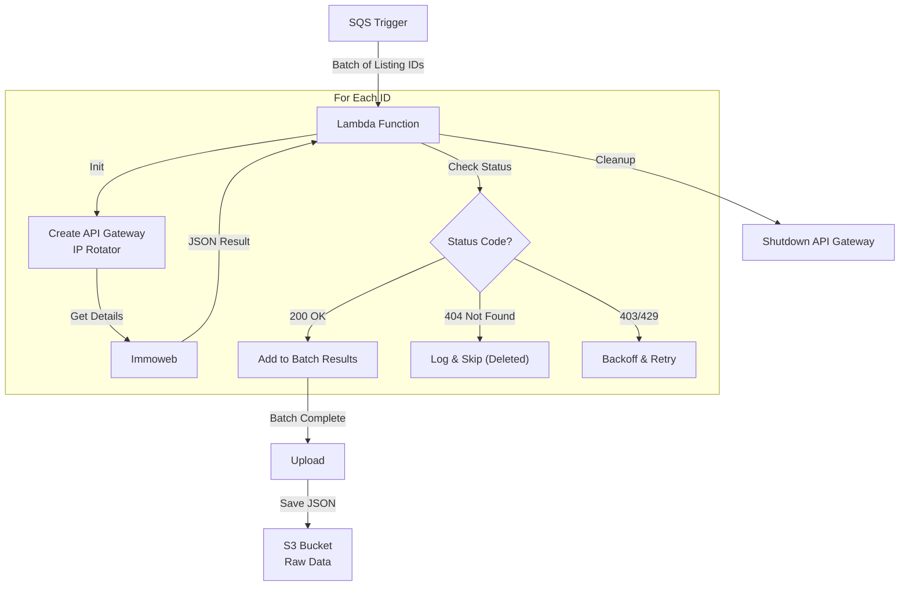

# Ads Batch Crawler Lambda

## Overview
This AWS Lambda function serves as the last worker of the real estate scraping part of the pipeline. It is responsible for the deep scraping of individual property listings.

Triggered by batches of listing IDs retreved by the previous worker, this function fetches the full details for each property (price, surface, energy class, etc.) and uploads the structured data to S3.

## Logic Flow & Architecture



## Inputs

### Trigger Event
The function is triggered by an SQS Event. The expected payload for each record is:

```json
{
  "transaction_type": "maison/a-vendre", 
  "listing_ids": [1234567, 7654321, ...]
}
```
*   `transaction_type`: Used for organizing output folders in S3.
*   `listing_ids`: A list of specific Immoweb classified IDs to fetch.

### Environment Variables

| Variable | Description |
|----------|-------------|
| `S3_BUCKET_NAME` | The S3 bucket where detailed ad JSONs are stored. |
| `ACCESS_KEY_ID` | AWS Credentials (required for `requests_ip_rotator`). |
| `ACCESS_KEY_SECRET` | AWS Secret Key (required for `requests_ip_rotator`). |

## Outputs

1.  **S3 Data Files**:
    *   **Path**: `s3://{BUCKET}/{transaction_type}/{sanitized_type}_{random}_{timestamp}.json`
    *   **Content**: A JSON Dictionary mapping `{ "ad_id": { ...ad_details... } }`.
    *   **Note**: `null` values in the source JSON are often converted to `"N/A"` or preserved depending on the specific serializer logic used (currently standard `json.dumps`).

## Key Components

### IP Rotation System
Just like the discovery/dispatcher functions, this crawler uses `requests_ip_rotator` to create a temporary API Gateway. This is critical for avoiding IP bans while making high-frequency requests for ad details.

### Error Handling
*   **404 Handling**: If a listing returns a 404, it is assumed to have been deleted after the ID was discovered. This is logged as `INFO` and the ID is skipped, rather than failing the batch.
*   **Retries**: 403 (`Forbidden`) and 429 (`Too Many Requests`) trigger a specialized retry loop with backoff.
*   **Failures**: If the Lambda times out or crashes, the batch of IDs remains in the SQS queue (via `batchItemFailures`) to be retried later.
